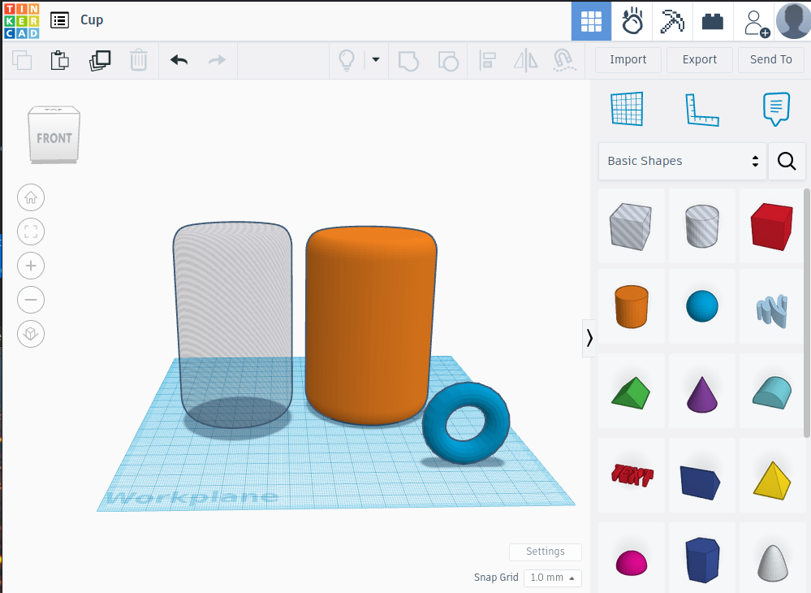
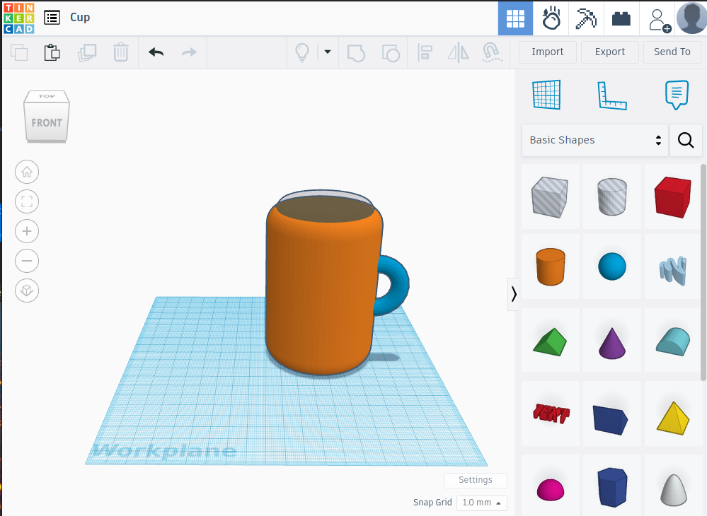
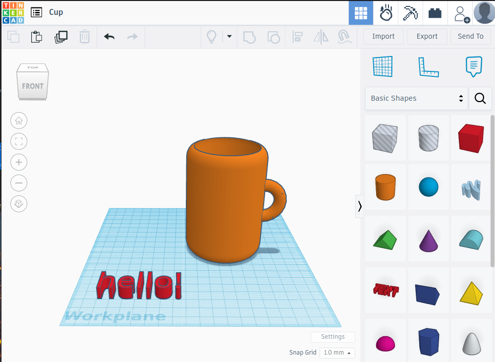
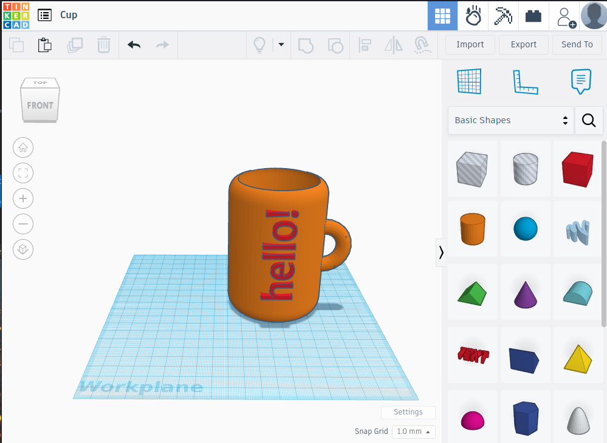
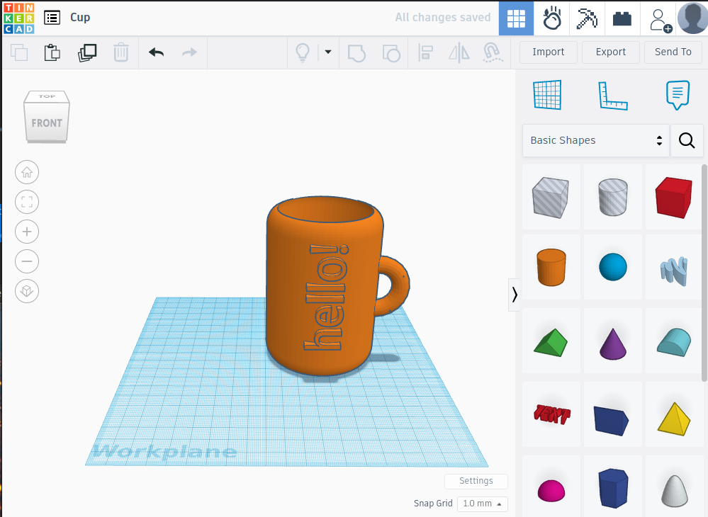
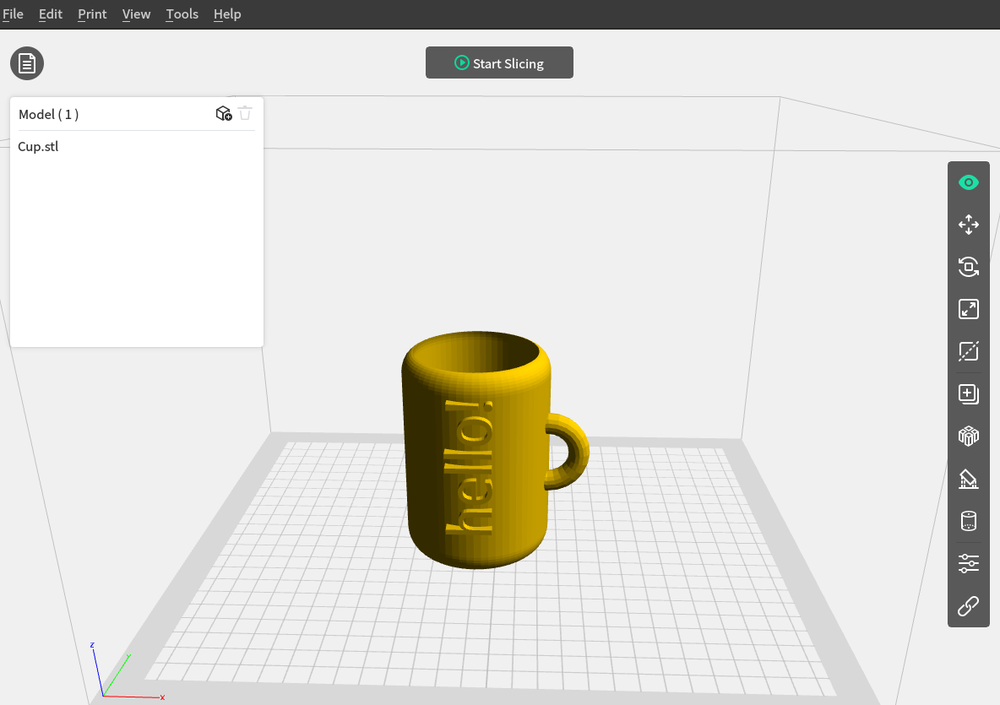

# 3D-cup

Σχεδιάζουμε μια διακοσμητική κούπα που μπορούμε να εκτυπώσουμε. Προσοχή οι 3D εκτυπώσεις δεν είναι κατάλληλες για τρόφιμα.

Η σχεδίαση γίνεται με το λογισμικό Tinkercad, ή άλλο παρόμοιο.

Βήματα:

1) Επιλέγουμε τον κύλινδρο και τον τόρο από τα γεωμετρικά στερεά, στρογγυλεύοντας αν θέλουμε τις γωνίες του κυλίνδου.
2) Διπλασιάζουμε τον κύλινδρο με αντιγραφή - επικόλληση και μετατρέπουμε τον έναν από τους δύο κυλίνδρους σε τρύπα.
3) Μικραίνουμε ελαφρώς το μήκος και το πλάτος της τρύπας αλλά όχι το ύψος και ευθυγραμμίζουμε τους δύο κυλίνδρους τον έναν μέσα στον άλλο.
4) Ευθυγραμμίζουμε τον τόρο στο πλάι της κούπας και ανυψώνουμε στο ύψος που επιθυμούμε.
5) Ομαδοποιούμε.
6) Με το εργαλείο κειμένου, γράφουμε μια λέξη και ρυθμίζουμε τις διαστάσεις.
7) Περιστρέφουμε και ευθυγραμμίζουμε στο πλάι της κούπας.
8) Ομαδοποιούμε.
9) Εξάγουμε το αρχείο .stl και το εισάγουμε σε λογισμικό slicer κατάλληλο για τον 3D εκτυπωτή που διαθέτουμε.
10) Προσαρμόζουμε τις ρυθμίσεις εκτύπωσης και εκτυπώνουμε στον 3D printer. 

      
|         Βήμα 1,2          |        Βήμα 3,4      |
|:----------------------------------:|:------------------------------------:|
|  |  |
|         Βήμα 5,6          |          Βήμα 7           |
|  |  |
|         Βήμα 8           |           Βήμα 9         |
|  |  |

To .stl αρχείο του 3D μοντέλου βρίσκεται στον φάκελο /stls μπορεί να το επεξεργαστεί κανείς σε λογισμικό επεξεργασίας 3D μοντέλων (π.χ. tinkercad) για περεταίρω προσαρμογές.

Η διάθεση του έργου αυτού γίνεται με άδεια Creative Commons Αναφορά Δημιουργού - Μη Εμπορική Χρήση - Παρόμοια Διανομή 3.0 Ελλάδα (CC BY-NC-SA 3.0 GR).

